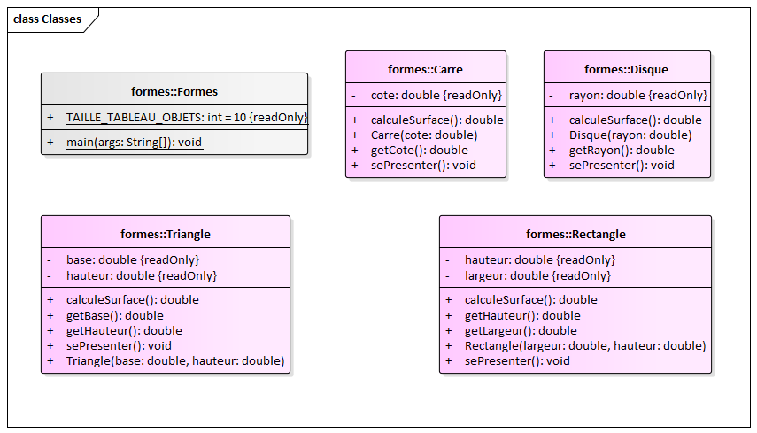
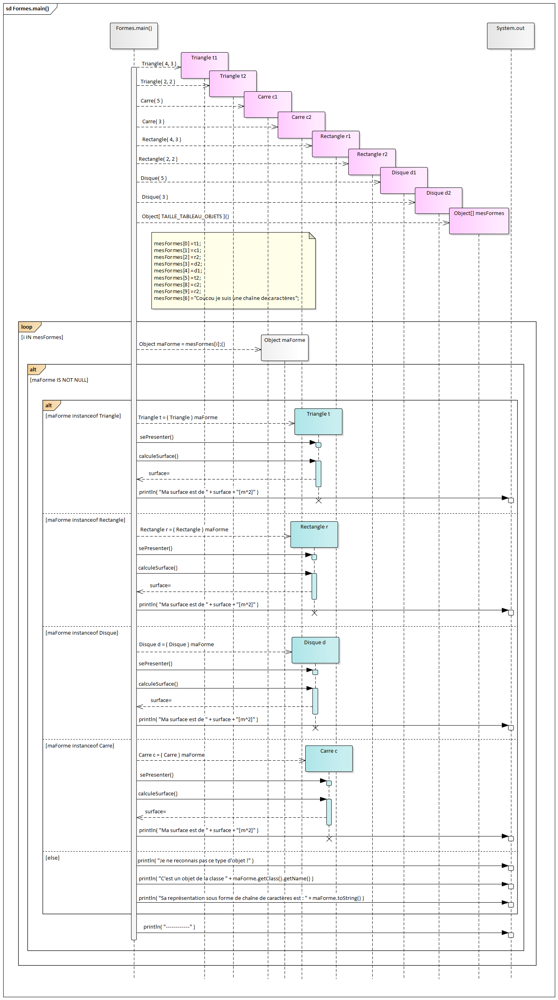

# Exercice 09 : Formes
## durée : 120'
## Objectifs visés :
Maîtriser les diagrammes de séquence ; comprendre que le code y est fourni. Premiers pas légers en direction des notions d’héritage Java.

## Travail à réaliser
Lisez avec attention les deux diagrammes fournis ci-après car ils contiennent en principe toutes les indications nécessaires afin d’implémenter ce nouveau projet Java « **Formes** ».

## Résultat à obtenir
Si votre code est correctement implémenté selon les directives reçues, vous devriez obtenir le résultat suivant sur la console :
```
Je suis un triangle de base 4.0[m] et de hauteur 3.0[m]
Ma surface est de 6.0[m^2]
-----------------------
Je suis un carré de côté 5.0[m]
Ma surface est de 25.0[m^2]
-----------------------
Je suis un rectangle de largeur 2.0[m] et de hauteur 2.0[m]
Ma surface est de 4.0[m^2]
-----------------------
Je suis un disque de rayon 3.0[m]
Ma surface est de 28.274333882308138[m^2]
-----------------------
Je suis un disque de rayon 5.0[m]
Ma surface est de 78.53981633974483[m^2]
-----------------------
Je suis un triangle de base 2.0[m] et de hauteur 2.0[m]
Ma surface est de 2.0[m^2]
-----------------------
Je ne reconnais pas ce type d'objet !
C'est un objet de la classe java.lang.String
Sa représentation sous forme de chaîne de caractères est : Coucou je suis une chaîne de caractères
-----------------------
Je suis un carré de côté 3.0[m]
Ma surface est de 9.0[m^2]
-----------------------
Je suis un rectangle de largeur 2.0[m] et de hauteur 2.0[m]
Ma surface est de 4.0[m^2]
-----------------------
```

### Diagramme de classes

### Diagramme de séquence

